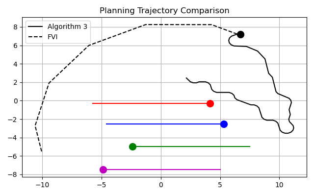

This repository provides a simulation environment for multi-target tracking using various types of sensors. It also had the ability to plan a trajectory for a mobile sennsor using metthods based on forward value iteration (FVI). This work was motivated by passive bearing-only sensors used in autonomous underwater vehicles. These sensors are subject to merged measurements where targets that are close in relative bearing to each other appear as a single merged measurement.

The merged measurement joint probabilistic data filter  trackingn system incoporated into a forward value iteration planner is decribed in the below paper, published in IEEE Robotics and Automation Letters in 2021
[Bearing-only active sensing under merged measurements](https://ieeexplore.ieee.org/iel7/7083369/7339444/09385895.pdf?casa_token=T-hbddLM0kcAAAAA:1gBppiq_1IR4VO1_psDwJH6IivvdfFyfWg9AobVE641ImGL_YhMyJZwztm404xRWay7Y2r6ftII)

The algorithm outlined in the above paper was implemented onboard a ground vehicle using cameras acting acting as bearinng-only sensors. The vehicle observes the other two target vehicles, updates its estimate of their locationn and vellocity and then plans a trajecotry in order to reduce uncertainty in the estimates of the targets.

Below shows the proposed algorithm (Algorithm 3) compared to a forward valu

<h3>Forward Valuue iteration with merged measuremet JPDAF</h3>

Optional description for the video.

<video src="https://github.com/user-attachments/assets/c012f9bb-62db-4047-86e3-3a3953f41ec9" controls width="100%"></video>

<h3>Forward Value Iteration with nearest neighbor data association</h3>

Optional description for the video.

<video src="https://github.com/user-attachments/assets/c9161cd9-9ad9-45e7-812c-85a85daeeae1" controls width="100%"></video>
